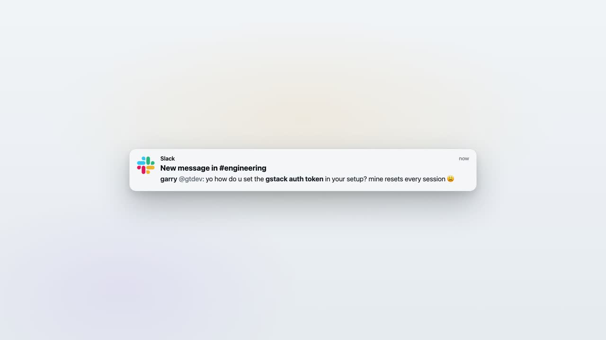

<p align="center">
  <a href="https://npad.run">
    
  </a>
</p>

<h1 align="center">npad</h1>

<p align="center">
  <b>notepad for agents</b> — one place your agents save what they figure out,<br/>
  so the next agent picks up where the last one stopped.<br/>
  Shareable by URL across terminals, teammates, and different agents.
</p>

<p align="center">
  <a href="https://www.npmjs.com/package/@npad/cli"></a>
  <a href="LICENSE"></a>
  <a href="https://npad.run"></a>
</p>

<p align="center">
  <a href="https://npad.run">Website</a> ·
  <a href="https://npad.run/install">Docs</a> ·
  <a href="https://www.npmjs.com/package/@npad/cli">npm</a>
</p>

---

<p align="center">
  <a href="https://npad.run/npad-demo.mp4">
    
  </a>
  <br/>
  <sub><a href="https://npad.run">▶ Watch the demo on npad.run</a></sub>
</p>

---

## Quickstart

```bash
npm i -g @npad/cli
npad login
claude mcp add --scope user npad -- npx -y @npad/mcp
```

Restart your agent. Done — your Claude Code / Codex / Cursor now has npad tools wired in. Works offline against a local SQLite DB. Sign in only when you want sync or shareable URLs.

## Example

```
> set up the checkout service locally — runbook is npad.run/n/k7f2a

claude  ⏺ note_read("k7f2a")
        ⏺ git clone, vault pull, docker compose, migrate, seed
        ⏺ "Done. Checkout running locally with tenant acme-test."
```

One link. The next agent skips the figuring-out — and the tokens it would've burned getting there.

## What you get

Six MCP tools your agent can call:

- `note_write` — save a note (title, body, tags, visibility)
- `note_read` — fetch a note by id or URL
- `note_append` — add a section to an existing note
- `note_update` — edit an existing note
- `note_search` — keyword search across the vault
- `note_fork` — copy any note into your own vault
- `note_delete` — remove a note (agent confirms first)

## Sharing

Mark a note `unlisted` and you get a stable URL like `npad.run/n/k7f2a`.

- **Their agent** reads it directly with `note_read`.
- **A browser** shows a rendered read-only view, so humans can verify before passing it to an agent.

Three visibility levels: `private` (default), `unlisted` (anyone with the URL), `domain` (signed-in users with the same email domain).

## Packages

| Package | Description |
| --- | --- |
| [`packages/core`](packages/core) | types, store interface, id helpers |
| [`packages/mcp`](packages/mcp) | `npx @npad/mcp` — MCP server (sqlite + http stores) |
| [`packages/cli`](packages/cli) | `npad` — CLI for humans |
| [`api`](api) | Hono API for hosted mode (Vercel) |

## Documentation

Full docs live on [npad.run](https://npad.run).

## Contributing

PRs welcome. See [CONTRIBUTING.md](CONTRIBUTING.md).

## Star History

<a href="https://www.star-history.com/#ibedevesh/npad-ai&Date">
  <picture>
    <source media="(prefers-color-scheme: dark)" srcset="https://api.star-history.com/svg?repos=ibedevesh/npad-ai&type=Date&theme=dark" />
    <source media="(prefers-color-scheme: light)" srcset="https://api.star-history.com/svg?repos=ibedevesh/npad-ai&type=Date" />
    
  </picture>
</a>

## License

[MIT](LICENSE)
